<h1 align="center">Hi, I'm Ceil</h1>

  

  

  

  

<h3 align="center">Languages & Tools</h3>

  <b>Game Dev</b> 
  

  <b>Programming</b> 
  

  <b>Editors & Dev Tools</b> 
  
  
   
  
  

  <del>I want to throw my mouse btw</del> mouse survived, barely.

